# Welcome to my page! &emsp;&emsp;&emsp; 

## About me
 
  Hi, I’m Hunter Soffos! 

- I've worked a range of engineering jobs, from mechanical to software, data, and AI/ML.
  - Fine-tuning LLMs
  - Building Scalable Agentic Workflows
  - Enabling Data Science & Research teams
  - Building sophisticated, enterprise-scale data pipelines
  - Eliminating toil through developer tooling
  - Full-stack engineering on customer-facing products
  - Building fine-grained, scalable construction estimation software

- My passions lie in financial and healthcare technology and applied AI/ML engineering!
  - I've led the development of multiple successful, large-scale, user-facing products from concept to production deployment and maintenance. 

### Some fully automated products I've built

  - Customer Complaints Analysis, Routing, and Handling
    - Significant reduction in workforce requirement
    - Improved regulatory standing

  - Insurance Analysis
    - Reliable, customizable, high-speed analysis of insurance documentation.

  - Slack chatbot
    - Quickly search / distill documentation based on user questioning

### I'm currently working at:
    Capital One

    Note: This account is not affiliated with Capital One

### I’m interested in collaborating on:
    Algorithmic Stock, Commodities, ForEx, and Futures Trading.

### I'm currently focused on:
      - High frequency securities trading
      - Algorithmic securities trading

### Paper collection:
#### &emsp;&emsp;MSCS  &nbsp;- Master of Science in Computer Science & Software Engineering  
#### &emsp;&emsp;MBA   &nbsp;&nbsp;&nbsp;- Master of Business Administration: Data Analytics and BI Management
#### &emsp;&emsp;BSME  &nbsp;- Bachelor of Science in Mechanical Engineering
#### &emsp;&ensp;&emsp;GCP  &nbsp;- Professional Data Engineer 
#### &emsp;&ensp;&emsp;PMP  &nbsp;- Project Management Professional
#### &emsp;&ensp;&emsp;CSM  &nbsp;- Certified Scrum Master 

 
 

  

